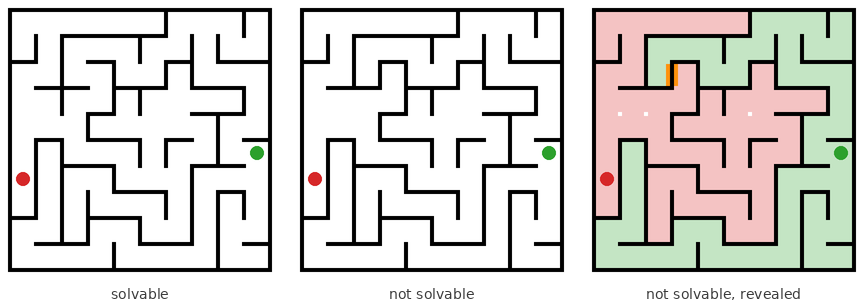

# Maze solvability: a snapshot classification task

Half of the mazes have a path from the start **S** to the goal **G**, half do not.
A human or a model sees one snapshot and answers *solvable* or *not solvable*.
The task targets the same computation as Pathfinder (is this contour connected to
that one?) but in a maze: the answer cannot be read from any local feature and
requires tracing connectivity through the whole image.



Everything is seeded and reproduced bit for bit by the browser code and the Python
package, so a maze looked at on the website can be regenerated in a dataset.

## Contents

| Path | What it is |
| --- | --- |
| `web/` | Static site, no build step. `maze.js` is the reference generator, `render.js` draws mazes, `prompt.js` holds the model prompt, `app.js` is the UI. |
| `mazes/` | Python package: `generate.py` (port of `maze.js`), `render.py` (PIL renderer, same geometry as `render.js`), `prompt.py`, `prng.py`. |
| `scripts/make_dataset.py` | Writes a balanced image dataset with labels, splits and full maze metadata. |
| `scripts/eval_model.py` | Sends snapshots (image, ASCII or both) to Claude and scores accuracy and d′. |
| `tests/` | pytest suite: independent solver checks, minimal-pair invariants, JS/Python parity, rendering. |

## Quick start

Open `web/index.html` in a browser (it works from a local file, no server needed;
`index.html` at the repo root redirects there so GitHub Pages can serve the repo root).

```bash
pip install -r requirements.txt
python -m pytest                                   # 90 tests, needs node for the parity tests

# 2000 medium mazes (10x10), exactly half solvable, 80/10/10 splits
python scripts/make_dataset.py --out data/medium --n 2000 --preset medium

# harder: 16x16, endpoints as far apart as possible, Pathfinder-like rendering
python scripts/make_dataset.py --out data/hard --n 5000 --width 16 --height 16 --loops 6 \
    --cut balanced --placement far --theme dark --markers dots --grayscale

# both members of every minimal pair (2 images per seed, never split apart)
python scripts/make_dataset.py --out data/pairs --n 1000 --preset medium --pairs

# ask a model (reads ANTHROPIC_API_KEY); --dry-run shows the prompts without calling the API
python scripts/eval_model.py --preset medium --n 40 --model claude-opus-5 --out results/opus5-medium.jsonl
python scripts/eval_model.py --dataset data/hard --split test --limit 200 --representation image
```

```python
import mazes
pos, neg = mazes.generate_pair(width=10, height=10, seed=7, loops=3)   # a minimal pair
m = mazes.generate(width=10, height=10, seed=7)                        # label = fair coin from the seed
print(mazes.to_ascii(m))
mazes.save_png(m, "maze.png", theme="dark", markers="dots")
mazes.solve(m)["solvable"]                                             # independent BFS check
```

## The website

- **Task**: blocks of trials with exact 50/50 labels in a shuffled order. Keys `F`/`Y`/`←`
  for solvable and `J`/`N`/`→` for not solvable. Options for a stimulus time limit
  (the maze is masked afterwards, the answer is still accepted), fixation interval and
  feedback (wrong answers reveal the solution or the two disconnected parts). Results
  show accuracy, hit rate, false-alarm rate, d′ and median RT, and export to CSV/JSON
  with the seed of every trial.
- **Explore**: step through seeds, view the solvable and unsolvable version side by
  side, overlay the solution or the components with the missing link highlighted,
  download PNG/JSON, copy the ASCII form or the model prompt.
- **Model**: sends snapshots straight from the browser to the Anthropic API and scores
  the replies. The key stays in the tab and only goes to `api.anthropic.com`; use a
  short-lived key, as anything in a browser can be read by whoever controls the page.
- **About**: the construction below and the keyboard shortcuts.

The settings panel (size, tree algorithm, endpoint placement, cut position, loops,
rendering style, theme, markers, wall thickness, grayscale) applies to all tabs.

## How the mazes are built

1. Draw a random spanning tree *T* over a W×H grid of cells (a perfect maze: every pair
   of cells is joined by exactly one path). Algorithms: recursive backtracker (long
   winding corridors), Kruskal or Prim (many short branches).
2. Place S and G: `random` (with a minimum Manhattan distance), `border` (opposite
   sides), `corners`, or `far` (G is the cell farthest from S along the tree).
3. Pick one wall segment *e* on the unique S→G path. Closing it splits the tree into a
   part A containing S and a part B containing G.
4. Pick `loops` extra passages X plus one more passage *w*, all joining two cells of
   the same part.

```
solvable   = T + X
unsolvable = T − e + X + w
```

The two versions of a seed form a **minimal pair**: the same number of walls, the
same S and G, the same endpoint distance, and they differ at exactly two wall
segments. So wall density, endpoint geometry, or a small enclosed pocket around an
endpoint never give the label away. What differs is global: the unsolvable maze has
one more cycle than the solvable one (unavoidable when the wall count is held fixed),
and S and G lie in different components.

Difficulty knobs, all recorded in every maze's metadata:

| Knob | Effect |
| --- | --- |
| `width`, `height` | length of the path to trace |
| `placement` | `far` maximises the tree path length; `random` is shorter and more variable |
| `cut` | where the S→G path is broken. `balanced` makes both disconnected parts large (no small pocket to spot); a number in [0, 1] is a position along the path, so `0.1` gives small pockets around S and is easy; `random` mixes |
| `loops` | extra passages in both versions. Keep it ≥ 1: with 0 loops the unsolvable maze is the only one with a cycle |
| `algorithm` | corridor texture |

Presets: `easy` 6×6, `medium` 10×10, `hard` 16×16 with `far` placement, `extreme` 24×24.
`meta.pocketFrac` (size of the smaller part as a fraction of all cells) and
`meta.treePathLength` are the most useful per-item difficulty measures; the evaluation
script reports accuracy by both.

Because connectivity is symmetric, S and G are interchangeable. The `dots` marker
style uses two identical discs, which turns the question into Pathfinder's "are these
two points connected?" and removes any start/goal semantics from the image.

## Data formats

A maze is a JSON object (identical from JS and Python):

```
width, height, seed, solvable, start [x, y], goal [x, y]
right[y][x] = 1 if there is an opening between (x, y) and (x+1, y)
down[y][x]  = 1 if there is an opening between (x, y) and (x, y+1)
params      normalised generation parameters (regenerate with mazes.generate(params))
meta        treePathLength, solutionLength, solution (solvable only), cutEdge (S-side
            cell first), openedEdge, loopEdges, componentSizes, pocketFrac, passages
```

`make_dataset.py` writes `images/ID.png`, `labels.csv` (id, seed, solvable, split,
pair index, path lengths, pocket fraction, endpoint coordinates), `mazes.jsonl` (full
objects) and `config.json`. Labels are exactly balanced inside every split; with
`--pairs` both members of a pair land in the same split. `--ascii` adds a text form
(`#` wall, `.` floor, `S`, `G`) for language models; `mazes.to_block_grid()` gives the
(2H+1)×(2W+1) pixel maze used by Pathfinder-style pixel renderings (`--style blocks`).

## Model evaluation

`scripts/eval_model.py` and the website's Model tab use the same prompt
(`web/prompt.js` / `mazes/prompt.py`) and the same trial construction (a session seed
gives the same seeds and labels in both), so browser and script runs are comparable.
The model is asked to think and finish with `ANSWER: YES` or `ANSWER: NO`; replies are
scored as hits/false alarms and summarised as accuracy and d′ overall, by pocket size
and by path length. Refusals, errors and unparsable replies are counted separately.
Server-side refusal fallbacks are off by default because a reply from a fallback
model would contaminate the score (`--fallbacks` turns them on).

## Reproducibility

The PRNG (mulberry32 with explicit 32-bit state), the seed hashing (integers modulo
2³², digit strings, FNV-1a for other strings) and every random draw are identical in
`web/maze.js` and `mazes/generate.py`; `tests/test_parity.py` runs both on the same
inputs and compares the JSON. Trial *i* of a session with seed *s* uses the maze seed
`normalizeSeed("s:i")`.
